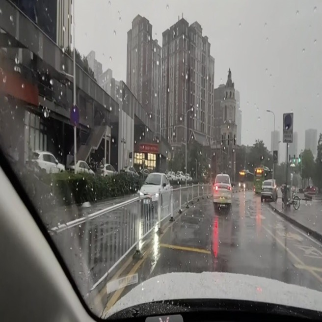
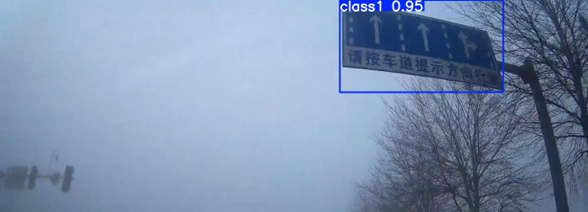

# IntelliSign
Traffic Sign Detection under Adverse Weather Conditions using YOLOv8 and Restormer

## Overview
IntelliSign is a computer vision project focused on robust traffic sign detection under adverse weather conditions such as rain, fog, snow, and glare.

The system uses YOLOv8 for object detection and integrates the Restormer image restoration model to study whether deraining improves detection performance.

The project investigates an important computer vision challenge:
> Does improving image quality always improve detection accuracy?

## Features
- Traffic sign detection using YOLOv8
- Evaluation across multiple weather conditions
- Rain artifact removal using Restormer
- Comparative performance analysis before and after preprocessing
- Shape-based traffic sign classification:
  - Rectangular
  - Circular
  - Triangular

## Tech Stack
- Python
- YOLOv8 (Ultralytics)
- OpenCV
- PyTorch
- Restormer
- NumPy

## Dataset
The dataset was organized into four weather-specific categories:
- Rain
- Fog
- Snow
- Glare

Annotations were provided in YOLO format with normalized bounding boxes.

## System Pipeline
Input Image → Optional Deraining (Restormer) → YOLOv8 Detection → Bounding Box Predictions

## Experimental Setup

### Baseline Detection
YOLOv8 evaluated directly on adverse weather images.

### Detection with Deraining
Rainy images processed using Restormer at:
- 256×256
- 512×512

Detection performance was then compared against the original images.

## Results

| Condition  | mAP@0.5 |
|------------|---------|
| Fog        | 0.882   |
| Snow       | 0.822   |
| Rain       | 0.695   |
| Glare      | 0.650   |

### Deraining Results

| Setup                | mAP@0.5 |
|----------------------|---------|
| Original Rain Images | 0.695   |
| Derained (256×256)   | 0.509   |
| Derained (512×512)   | 0.690   |

## Rain Restoration Comparison

| Original | Derained 512×512 | Derained 256×256 |
|---|---|---|
|  |  |  |

### Key Insight
Although Restormer improved visual image quality, detection accuracy did not improve consistently due to:
- distribution shift
- loss of spatial details during downscaling

This highlights the importance of training-inference consistency in deep learning systems.

## Detection Output

Traffic sign detection under adverse weather conditions using YOLOv8.

### Original Rain-Affected Image

### Restormer Output (512×512)

### Restormer Output (256×256)

